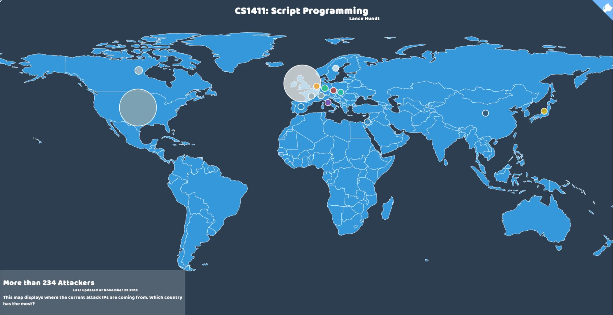

# Assignment 8
**Script Language:** Python

**VM:** CS1411-Kali

## Goal
This assignment you are a security professional that has been asked to create a visual world map of a sophisticated network of computers all over the world participating in a major cyber crime against the US. In this assignment, you will be using python and techniques learned in class to process a log file (access.log) containing the IP addresses of the source IP addresses involved in the attack. You job is to extract all IP addresses from the log file. Then take all unique IP addresses and perform a geolocation lookup on the IP address that will return a country code. Below is an example of what your map should look like.

It’s very common practice to combine multiple tool sets to get to your end goal. At the core of this project you will be using to code the Python portions only. Additional JavaScript packages are included in the assignment files which are only used to generate the beautiful world map.

[Azure Maps API](https://learn.microsoft.com/en-us/rest/api/maps/geolocation/get-ip-to-location?view=rest-maps-1.0&tabs=HTTP)– In order to translate an IP address to a physical world country, we will rely on a cloud service to perform this task for us. This service will return the ISO country code for the provided IP address.

 

After the map is generated, you should be able to answer the following questions…

 

How many countries were identified with attacker addresses?
Which country contained the most unique attacker addresses?
How many total attackers have been identified?
 

**Required Tools:**

* VirtualBox
* Kali Linux
* Visual Studio Code
* Python 3
* Javascript: Datamaps and d3.js to build the map.
* Azure Maps API (Geocoding)
